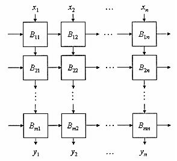
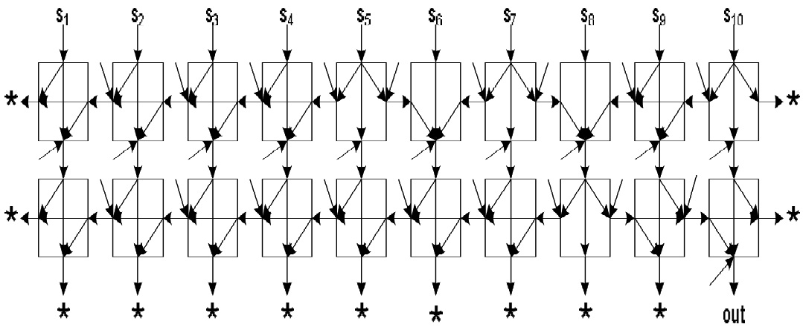

# Block-Based Neural Network Trained with Genetic Algorithm
This is a block-based neural network implementation, which is trained via genetic algorithm.

## Description
Block-based neural network (BBNN) is a type of 2-dimensional networks that have a data flow both vertically and horizontally. The following is an example of a 2-D data flow in a BBNN:
<p align="center">
  
</p>

In the current implementation, besides the weights, direction of the connections in the BBNN can also be specified. Each block has four nodes at its four edges. The nodes can be an input or a neuron. There is always at least one neuron and at most three neurons in a block. Since this network is not meant to have loops, always one side of all the blocks is an input, therefore it is not possible to move activations back to earlier neurons. This means that there is the concept of layers in the BBNN, but data can also move along a layer too. 

The genetic algorithm is responsible for training the network. It creates a population of network parameters (connection directions and weights as well as biases) and then using the delete-the-worst steady-state procedure tries to improve the network over iterations. The crossover of two networks can be in two shapes: By exchanging some of the corresponding connections of the two networks, or by stochastically *balancing* each two selected coresponding weights through a randomized weighted sum. The mutation operation can also change a connection weight randomly or flip the direction of a connection.

This work has been used in our published paper ([pdf](docs/2013-PRIA.pdf) or [IEEE Xplore](https://doi.org/10.1109/PRIA.2013.6528434)) to classify Sinus Tachycardia (ST) and Ventricular Tachycardia (VT) heart signals. The following shows the relatively small network architecture developed for this purpose:
<p align="center">
  
</p>

## The Code
The block-based neural network and its genetic algorithm training method are written in MATLAB. The code can be found under the *ga-bbnn* directory. There are five files there, namely from top-level to down: *Genetic Algorithm*, *Fitness Function*, *Neural Network*, *Neuron Block*,  and *Activation Function*. The file names are quite representative of their functionalities. The genetic algorithm invokes the fitness function, which it in turn calls the neural network to compute the error in predictions. The neural network is comprised of multiple neeron blocks and each neuron block has a number of activation functions for every neuron that it encompasses.

# Citation
You may refer to this work by citing our [paper](https://doi.org/10.1109/PRIA.2013.6528434).
```
@inproceedings{niknam2013novel,
  title={A novel evolutionary algorithm for block-based neural network training},
  author={Niknam, Amin and Hoseini, Pourya and Mashoufi, Behbood and Khoei, Abdollah},
  booktitle={2013 First Iranian Conference on Pattern Recognition and Image Analysis (PRIA)},
  pages={1--6},
  year={2013},
  organization={IEEE}
}
```

# Developers
[Pourya Hoseini](https://github.com/pouryahoseini)

# Contact
I can be reached at hoseini@nevada.unr.edu